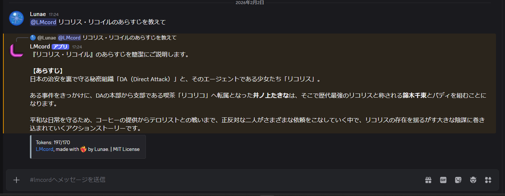

# LMcord
<p align="center">
  
  
</p>
Discord上で @メンションで呼び出せるAIボットです。

## 主な機能
- `@ボット名 質問` で起動
- チャンネル履歴参照
- 返信チェーン参照
- Web検索の呼び出しに対応
    - **Gemini API使用時:** Grounding with Google SearchであるいはTabilyでのWeb検索
    - **OpenAI API使用時:** TavilyでのWeb検索に対応
- Gemini API / OpenAI互換APIに対応
- **Gemini API使用時:** 画像・PDF・テキストの添付解析（Files API使用）

## サポートするAPI
### Google Gemini API (PLATFORM=google) (既定)
- `GOOGLE_API_KEY` が必要
- **Grounding with Google Search:** `ENABLE_GOOGLE_GROUNDING=true` で有効（既定で有効）

### OpenAI互換API (PLATFORM=openai)
- OpenAI、OpenRouter、その他OpenAI互換API
- `OPENAI_API_KEY` と `OPENAI_BASE_URL` が必要

## セットアップ
Dockerをおすすめします。Dockerでデプロイする場合、手順(1)は不要です。

1) 依存関係のインストール（ローカルでデプロイする場合）
```bash
pip install -r requirements.txt
```

2) .env作成
`.env.example` を `.env` にコピーして値を設定してください。

### Google Gemini APIを使う場合（推奨）
```env
PLATFORM=google
GOOGLE_API_KEY=your_google_api_key
MODEL=gemini-2.0-flash-exp
ENABLE_GOOGLE_GROUNDING=true
```

### Google Grounding with Google Searchを無効にする場合
Gemini APIのFree Tierでは、本機能は使用できませんから無効にしてください。
```env
ENABLE_GOOGLE_GROUNDING=false
ENABLE_WEB_SEARCH=true
TAVILY_API_KEY=your_tavily_api_key
```

### OpenAI APIを使う場合
```env
PLATFORM=openai
OPENAI_API_KEY=your_openai_api_key
OPENAI_BASE_URL=https://api.openai.com/v1
MODEL=gpt-4o
ENABLE_WEB_SEARCH=true
TAVILY_API_KEY=your_tavily_api_key
```

### OpenRouterを使う場合
```env
PLATFORM=openai
OPENAI_API_KEY=your_openrouter_api_key
OPENAI_BASE_URL=https://openrouter.ai/api/v1
MODEL=anthropic/claude-3.5-sonnet
ENABLE_WEB_SEARCH=true
TAVILY_API_KEY=your_tavily_api_key
```

## 環境変数の説明
- `DISCORD_TOKEN` - Discord Bot Token
- `PLATFORM` - 使用するプラットフォーム: `google` または `openai`
- `GOOGLE_API_KEY` - Google Gemini APIキー（PLATFORM=google時に必須）
- `OPENAI_API_KEY` - OpenAI互換APIキー（PLATFORM=openai時に必須）
- `MODEL` - 使用するモデル
- `ENABLE_GOOGLE_GROUNDING` - Google Searchでの情報取得を有効にするか（google使用時）
- `PERSONA` - ボットのペルソナ・キャラクター設定（オプション）
- `TAVILY_API_KEY` - Tavily Web検索APIキー（フォールバック検索用）
- `CHANNEL_HISTORY_LIMIT` - 参照するチャンネル履歴件数（既定: 15）
- `REPLY_CHAIN_LIMIT` - 参照する返信チェーンの深さ（既定: 15）
- `MAX_ATTACHMENTS_PER_MESSAGE` - 1メッセージあたりの添付上限（既定: 10）
- `MAX_ATTACHMENT_SIZE_MB` - 添付1件あたりの最大サイズ（MB, 既定: 10）

## ペルソナ（キャラクター）設定
環境変数 `PERSONA` でボットのキャラクターや役割を設定できます。

## Discordボットの作成とトークン取得
1) Discord Developer Portal にアクセスし、新しいアプリを作成します。
2) 左メニューの「Bot」から Bot を追加し、Token を発行します。
3) `DISCORD_TOKEN` に発行したトークンを設定します。

### 必要なIntents
以下を有効にしてください。
- MESSAGE CONTENT INTENT

### 必要な権限（推奨）
ボットをサーバーに招待する際、以下の権限が必要です。
- View Channels
- Read Message History
- Send Messages
- Embed Links（任意）

### 招待URLの作り方
1) Developer Portal の「OAuth2」→「URL Generator」へ移動
2) Scopes で「bot」を選択
3) Bot Permissions で上記権限を選択
4) 生成されたURLでサーバーに招待

## APIキーの取得方法

### Google Gemini API キー
1. [Google AI Studio](https://aistudio.google.com) にアクセス
2. 「Get API Key」をクリック
3. 「Create API Key」から新しいキーを生成
4. キーをコピーして `.env` に設定

### Tavily API キー
1. [Tavily公式サイト](https://tavily.com) にアクセス
2. サインアップして API キーを取得
3. キーを `.env` に設定

### OpenAI API キー
1. [OpenAI Platform](https://platform.openai.com/api-keys) にアクセス
2. ログインして「Create new secret key」
3. キーをコピーして `.env` に設定

### OpenRouter API キー
1. [OpenRouter](https://openrouter.ai) にサインアップ
2. 「Keys」ページからキーを生成
3. キーをコピーして `.env` に設定

## 起動

### ローカル環境
```bash
python bot.py
```

### Docker Compose（推奨）
```bash
docker compose up -d
```

ログ確認:
```bash
docker compose logs -f
```

停止:
```bash
docker compose down
```

### Docker（手動ビルド）
```bash
docker build -t llm-discord-bot .
docker run -d --name llm-discord-bot --env-file .env llm-discord-bot
```

## 使い方
Discordで以下のように呼び出してください。
```
@ボット名 質問内容
```

呼び出したチャンネルの直近の会話や返信チェーンも読み込んで応答します。

### 添付ファイルについて
- **Gemini API使用時:** 画像・PDF・テキストの添付に対応（Files API使用）
- **OpenAI互換API使用時:** 添付ファイル入力は非対応（添付があるとエラーで停止）
- **制限:** 1メッセージあたり最大10件、10MB/件

### 使用例
```
@LLMcord 東京の今の天気は？
@LLMcord 最近のPythonの新しい機能について教えて
@LLMcord 2024年のノーベル賞受賞者は？
```

また、空入力の場合は現在の設定値とヘルプを返します。

---
Made with ❤️‍🔥 by Lunae.